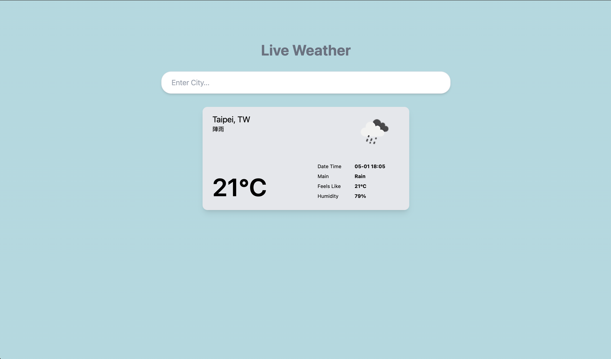
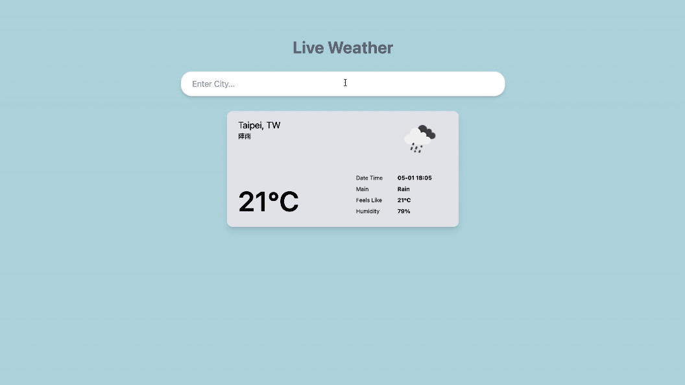

# A simple Live Weather

## 📋 Description

A Live Weather (OpenWeather Free API) with React.

## 🔍 Function

Get weather information through OpenWeather Free API.

Enter the city to know the current weather.

## 🛠️ Technologies & Requirements

- Node.js (20.6)
- React (18)
- Tailwind CSS
- AXIOS
- Need to apply for `openweathermap` API key

## 💻 Demo Screenshot





## 🚀 Getting Started

1. Register [OpenWeather](https://openweathermap.org/) API to get API KEY (free)

2. Download ZIP or git clone

3. Install the packages

```
$ npm install.
```

4. Replace the `apiKey` in `index.js` with your KEY

5. Run the server

```
$ npm run dev.
```

6. Open http://localhost:3000 to view it in your browser.

## 👤 Author

Email:yiting536@gmail.com

## ⭕️ Warning

This is purely for practice and not for any profit-making purpose.Thanks!

## ⚠️ Notice

For security reasons, the API key has been removed first.
